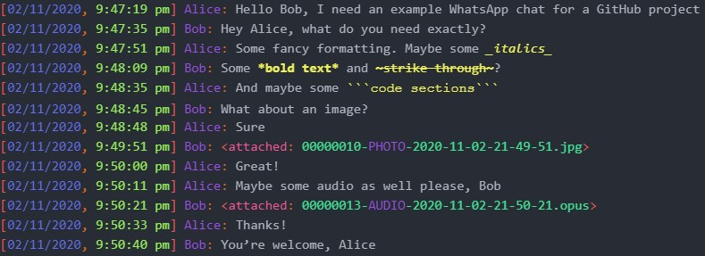

# WhatsApp-Formatter

A program to convert WhatsApp chats exported as zip files into formatted HTML files for easier reading.

---

## Notices:
- Feel free to change `Library/background-image.jpg` to whatever background image you'd like, just make sure it has the same name
- If you're formatting a group chat, please add the participants' names to `Library/group_chat_names.css` with colours, following the examples given at the top of the file

## Dependencies:
- [pydub](http://pydub.com/)

---

## Steps:

### Command Line:
1. Export the desired chat on your phone (must be in 12-hour time format)
2. Run formatter_cli.py
3. Enter the name of the first zip file
4. If it's a group chat, type anything beginning with a `y` or `Y`
5. Enter the name of the sender (your WhatsApp alias)
6. Enter the desired title of the chat
7. Enter the desired name of the output file
8. Enter a full output directory
9. Type anything beginning with a `y` or `Y` to add another chat
10. Repeat steps 3-9 until you have selected all chats
11. Type anything not beginning with a `y` or `Y` to process and format all chats. (If there are many large zip files, this may take some time)
12. The program will exit when all chats have been processed

### GUI:
1. Export the desired chat on your phone (must be in 12-hour time format)
2. Run formatter_gui.py or formatter.exe
3. Select the first zip file with the `Select an exported chat` button
4. Tick the box if it's a group chat
5. Enter the name of the sender (your WhatsApp alias)
6. Enter the desired title of the chat
7. Enter the desired name of the output file
8. Select an output directory with the `Select an output directory` button
9. Click the `Add to list` button
10. Repeat steps 3-9 until you have selected all your chats
11. Click the `Process all` button to process and format all chats. (If there are many large zip files, this may take some time)
12. When all chats have been processed, the `Processing...` text will disappear, the `Exit` button will become enabled, and it will be safe to exit

---

## Example:
See `Example/` directory for files.

### Original:

With my [language-whatsapp](https://github.com/DoctorDalek1963/language-whatsapp) syntax highlighting package for Atom:

### Formatted:

