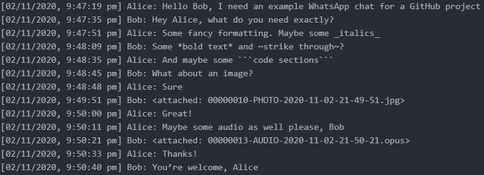
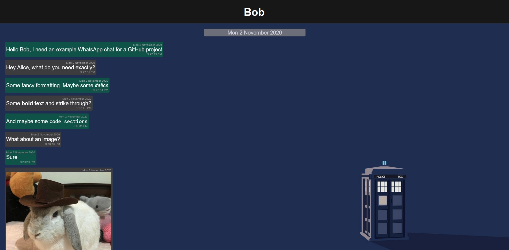

# WhatsApp-Formatter

A program to convert WhatsApp chats exported as zip files into formatted HTML files for easier reading.

---

## Notices:
- Feel free to change `Library/background-image.jpg` to whatever background image you'd like, just make sure it has the same name

## Dependencies:
- [pydub](http://pydub.com/)

---

## Steps (Command Line):
1. Export the desired chat on your phone (must be a private chat; group chats don't work)
2. Run whatsapp_formatter.py
3. Enter the name of the zip file
4. Enter a full output directory
5. Enter the name of the recipient
6. Wait until the program tells you that the process is complete (If the zip file is large, this may take quite a while)
7. You can continue and format another zip file, or you can exit

## Steps (GUI):
1. Export the desired chat on your phone (must be a private chat; group chats don't work)
2. Run whatsapp_formatter_gui.py
3. Select the zip file from the file selection dialog
4. Select an export directory from the directory selection dialog
5. Enter the name of the recipient
6. Click the `Format` button
7. Wait for the `Formatting...` text to disappear (If the zip file is large, this may take quite a while)
8. Select another zip file to format or click `Exit` to close the program

---

## Example:
See `Example/` directory for files.

### Original:

### Formatted:

