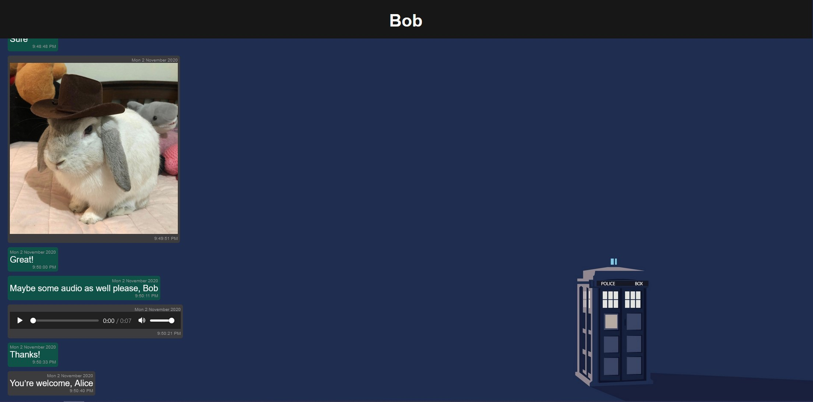

# WhatsApp-Formatter

A program to convert WhatsApp chats exported as zip files into formatted HTML files for easier reading.

---

## Notices:
- Feel free to change `Library/background-image.jpg` to whatever background image you'd like, just make sure it has the same name

## Dependencies:
- [pydub](http://pydub.com/)

---

## Steps (Single):

If you have a single chat you want to format, follow these instructions.

### Command Line:
1. Export the desired chat on your phone (must be a private chat; group chats don't work)
2. Run single_cli.py
3. Enter the name of the zip file
4. Enter a full output directory
5. Enter the name of the recipient
6. Wait until the program tells you that the process is complete (If the zip file is big, this may take some time)
7. You can continue and format another zip file, or you can exit

### GUI:
1. Export the desired chat on your phone (must be a private chat; group chats don't work)
2. Run single_gui.py or single_gui.exe
3. Select the zip file with the `Select an exported chat` button
4. Select an export directory with the `Select an output directory` button
5. Enter the name of the recipient
6. Click the `Format` button
7. Wait for the `Formatting...` text to disappear (If the zip file is big, this may take some time)
8. Select another zip file to format or click `Exit` to close the program

## Steps (Multiple):

If you have multiple chats you want to format, follow these instructions.

### Command Line:
1. Export the desired chat on your phone (must be a private chat; group chats don't work)
2. Run multiple_cli.py
3. Enter the name of the first zip file
4. Enter a full output directory
5. Enter the name of the recipient
6. Type anything beginning with a `y` or `Y` to add another chat
7. Repeat steps 3-6 until you have selected all chats
8. Type anything not beginning with a `y` or `Y` to process and format all chats
9. If there are many, large zip files, this may take some time
10. The program will exit when all chats have been processed

### GUI:
1. Export the desired chat on your phone (must be a private chat; group chats don't work)
2. Run multiple_gui.py or multiple_gui.exe
3. Select the first zip file with the `Select an exported chat` button
4. Select an export directory with the `Select an output directory` button
5. Enter the name of the recipient
6. Click the `Add to list` button
7. Repeat steps 3-6 until you've selected all chats
8. Click the `Process` button to process and format all chats
9. If there are many, large zip files, this may take some time
10. When all chats have been processed, the `Processing...` text will disappear, the `Exit` button will become enabled, and it will be safe to exit

---

## Example:
See `Example/` directory for files.

### Original:

### Formatted:

